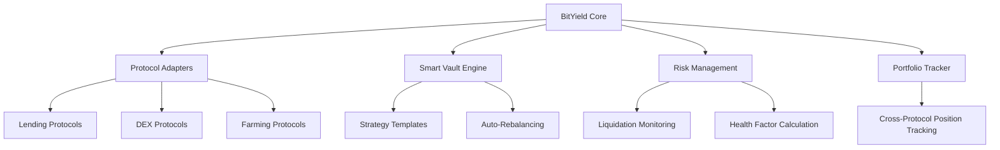
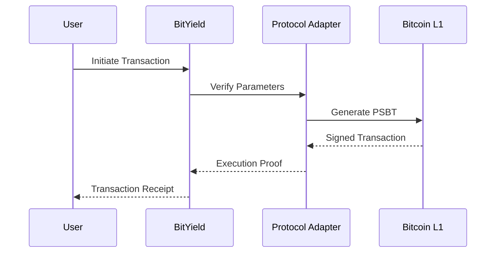

# BitYield - Bitcoin-Native Yield Optimization Protocol

A decentralized yield optimization protocol built on Stacks (Bitcoin L2) that enables automated asset allocation across multiple DeFi protocols with Bitcoin-finality security guarantees.

## Features

- **Smart Vault Strategies**: Create automated yield strategies with custom risk profiles (1-10)
- **Protocol Aggregation**: Unified access to major Stacks DeFi protocols (lending, DEXs, farming)
- **Bitcoin-Native Security**: All settlements finalized on Bitcoin blockchain
- **Risk Management Engine**: Real-time liquidation risk monitoring and alerts
- **Portfolio Tracker**: Unified dashboard for cross-protocol positions
- **Gasless Transactions**: Batch operations across multiple protocols
- **Transparent APY Calculations**: On-chain yield tracking with verifiable metrics

## Architecture

### System Components



### Core Modules

1. **Protocol Registry**
   - Curated list of integrated DeFi protocols
   - Protocol metadata and risk parameters
   - Supported assets and interaction methods

2. **Smart Vault Engine**
   - Strategy creation and template marketplace
   - Automated asset allocation/rebalancing
   - Yield compounding and fee management

3. **Risk Management System**
   - Real-time position health monitoring
   - Liquidation risk alerts
   - Automatic safety margin adjustments

4. **Portfolio Tracker**
   - Unified position tracking across protocols
   - Net APY calculations
   - Historical performance analytics

5. **Gasless Transaction Router**
   - Meta-transaction support
   - Batch operation processing
   - Slippage-controlled executions

## Security Model

### Key Security Features

- **Bitcoin Settlement Finality**: All critical operations settled on Bitcoin L1
- **Protocol Whitelisting**: Curated list of audited DeFi protocols
- **Risk Parameters**:
  - LTV Ratios
  - Liquidation thresholds
  - Protocol-specific risk scores
- **Transparent Governance**:
  - On-chain parameter updates
  - Time-locked admin operations
  - Decentralized emergency stops

### Audit & Verification



## Getting Started

### Requirements

- [Clarinet](https://docs.hiro.so/clarinet)
- Node.js v18+
- Bitcoin testnet node (optional)

### Installation

```bash
git clone https://github.com/sarah-savi/btc-native-yield.git
cd btc-native-yield
clarinet install
npm install @stacks/transactions @stacks/network
```

### Example Usage

**Create a Yield Vault**
```typescript
import { callReadOnlyFunction } from '@stacks/transactions';

const vaultId = await callReadOnlyFunction({
  contractAddress: 'SP3FBR2AGK5H9QBDH3EEN6DF8EK8JY7RX8QJ5SVTE',
  functionName: 'create-vault',
  args: [
    stringAsciiCV('BTC Yield Strategy'),
    stringUtf8CV('Conservative BTC-backed yield generation'),
    stringAsciiCV('conservative'),
    uintCV(1500), // Target APY (15%)
    uintCV(3),    // Risk level
    listCV([
      tupleCV({
        'protocol-id': uintCV(1),
        'percentage': uintCV(60)
      }),
      tupleCV({
        'protocol-id': uintCV(2),
        'percentage': uintCV(40)
      })
    ])
  ],
  network: stacksNetwork,
  senderAddress: userAddress
});
```

**Deposit to Vault**
```clarity
(contract-call? 'SP3FBR2AGK5H9QBDH3EEN6DF8EK8JY7RX8QJ5SVTE deposit-to-vault u1 u500000)
```

## Contributing

1. Fork the repository
2. Create feature branch (`git checkout -b feature/amazing-feature`)
3. Commit changes (`git commit -m 'Add amazing feature'`)
4. Push to branch (`git push origin feature/amazing-feature`)
5. Open Pull Request
